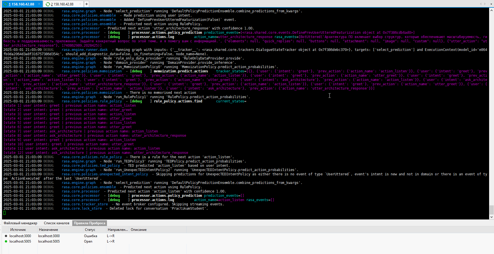

### Разворачивание рабочей машины в облаке

Проверка состояния ресурсов в облаке:  
``` sh
D:\projects\architecture-sprint-5\terraform>terraform plan
data.template_file.cloudinit: Reading...
data.template_file.cloudinit: Read complete after 0s [id=702b477694818ba3bd25d48549503cc980ef541a9ade5ac148572eea2cd8713e]
data.yandex_compute_image.vm_image: Reading...
yandex_vpc_network.develop: Refreshing state... [id=enpolrs9tis0ljpqjevr]
data.yandex_compute_image.vm_image: Read complete after 0s [id=fd8djbgegad0grd7srks]
yandex_vpc_subnet.develop: Refreshing state... [id=e9b0a6lru9fnv6jpg9sl]
yandex_compute_instance.workspace: Refreshing state... [id=fhm886mrmbel2qrdve9b]
local_file.hosts_cfg: Refreshing state... [id=f4c295f335440dca42f7047e14fe0881c7087c35]

No changes. Your infrastructure matches the configuration.

Terraform has compared your real infrastructure against your configuration and found no differences, so no changes are
needed.

```

### Установка и настройка окружения

``` bash
qwuen@fhm886mrmbel2qrdve9b:~$ python3
Python 3.10.12 (main, Jan 17 2025, 14:35:34) [GCC 11.4.0] on linux

qwuen@fhm886mrmbel2qrdve9b:~$ sudo apt install python3-pip
qwuen@fhm886mrmbel2qrdve9b:~$ sudo apt-get install python3-venv
qwuen@fhm886mrmbel2qrdve9b:~$ python3 -m ensurepip
ensurepip is disabled in Debian/Ubuntu for the system python.
qwuen@fhm886mrmbel2qrdve9b:~$ pip install virtualenv
qwuen@fhm886mrmbel2qrdve9b:~$ sudo update-alternatives --install /usr/bin/python python /usr/bin/python3 10
qwuen@fhm886mrmbel2qrdve9b:~$ python
Python 3.10.12 (main, Feb  4 2025, 14:57:36) [GCC 11.4.0] on linux
qwuen@fhm886mrmbel2qrdve9b:~$ python -m venv rasa_env
qwuen@fhm886mrmbel2qrdve9b:~$ source rasa_env/bin/activate
(rasa_env) qwuen@fhm886mrmbel2qrdve9b:~$
```

### Установка Rasa

``` bash
qwuen@fhm886mrmbel2qrdve9b:~$ source rasa_env/bin/activate
(rasa_env) qwuen@fhm886mrmbel2qrdve9b:~$ pip install rasa
(rasa_env) qwuen@fhm886mrmbel2qrdve9b:~$  pip install transformers
Collecting transformers
Installing collected packages: tokenizers, transformers
Successfully installed tokenizers-0.21.0 transformers-4.49.0
(rasa_env) qwuen@fhm886mrmbel2qrdve9b:~$ rasa --version
/home/qwuen/rasa_env/lib/python3.10/site-packages/rasa/core/tracker_store.py:1044: MovedIn20Warning: Deprecated API features detected! These feature(s) are not compatible with SQLAlchemy 2.0. To prevent incompatible upgrades prior to updating applications, ensure requirements files are pinned to "sqlalchemy<2.0". Set environment variable SQLALCHEMY_WARN_20=1 to show all deprecation warnings.  Set environment variable SQLALCHEMY_SILENCE_UBER_WARNING=1 to silence this message. (Background on SQLAlchemy 2.0 at: https://sqlalche.me/e/b8d9)
  Base: DeclarativeMeta = declarative_base()
Rasa Version      :         3.6.21
Minimum Compatible Version: 3.6.21
Rasa SDK Version  :         3.6.2
Python Version    :         3.10.12
Operating System  :         Linux-5.15.0-131-generic-x86_64-with-glibc2.35
Python Path       :         /home/qwuen/rasa_env/bin/python
```

### Настройка Rasa и подключение модели

``` sh 
(rasa_env) qwuen@fhm886mrmbel2qrdve9b:~$ rasa train
2025-03-01 19:59:12 INFO     rasa.engine.training.hooks  - Finished training component 'UnexpecTEDIntentPolicy'.
Your Rasa model is trained and saved at 'models/20250301-195759-full-turret.tar.gz'.

```

### Развёртывание веб-приложения


``` sh
qwuen@fhm886mrmbel2qrdve9b:~$ mkdir app
qwuen@fhm886mrmbel2qrdve9b:~$ cd app
qwuen@fhm886mrmbel2qrdve9b:~/app$ git clone https://github.com/Yandex-Practicum/architecture-sprint-5.git
Cloning into 'architecture-sprint-5'...
qwuen@fhm886mrmbel2qrdve9b:~/app/architecture-sprint-5$ npm install
qwuen@fhm886mrmbel2qrdve9b:~/app/architecture-sprint-5$ npm run build
qwuen@fhm886mrmbel2qrdve9b:~/app/architecture-sprint-5$ npm run start
```

### Перезапуск API с подробным логом



``` sh
(rasa_env) qwuen@fhm886mrmbel2qrdve9b:~$ rasa run --enable-api --cors "*" --log-file rasa_debug.log -vv

```

### Демонстрация работы

  

[Логи Rasa](/rasa/rasa_debug.log)  